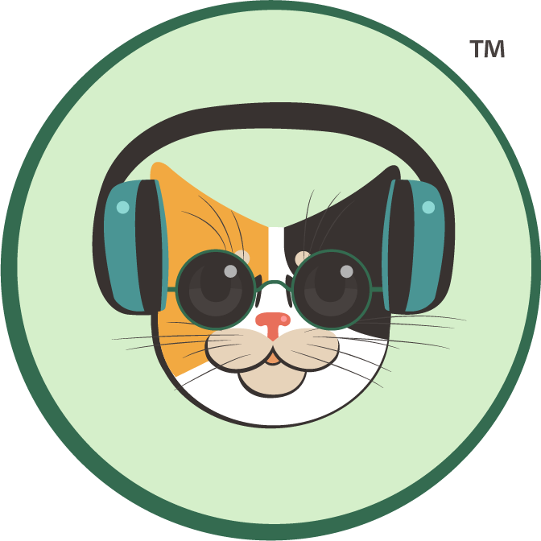
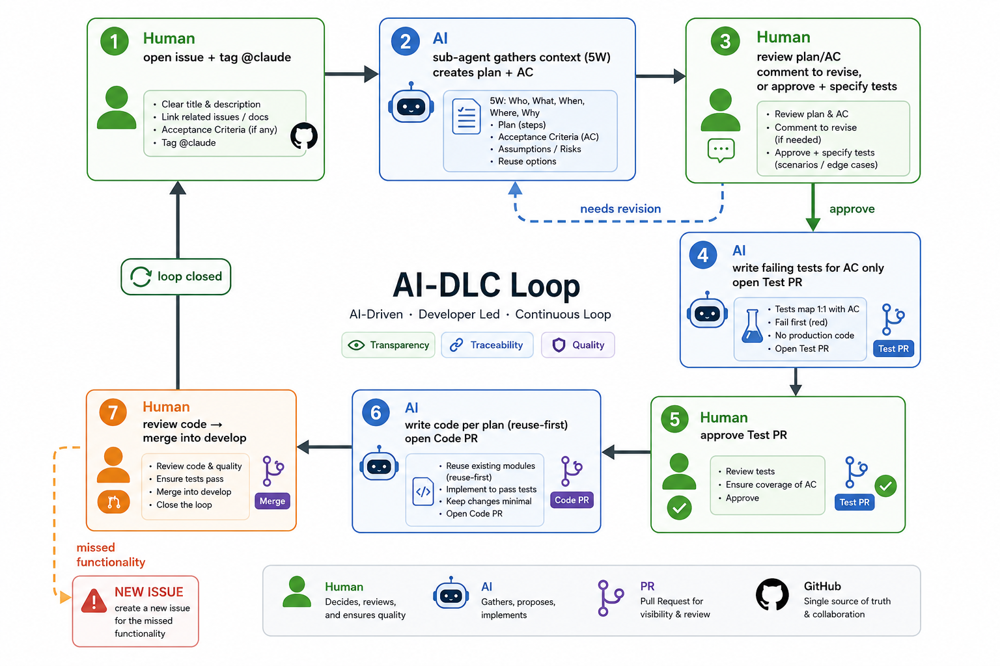
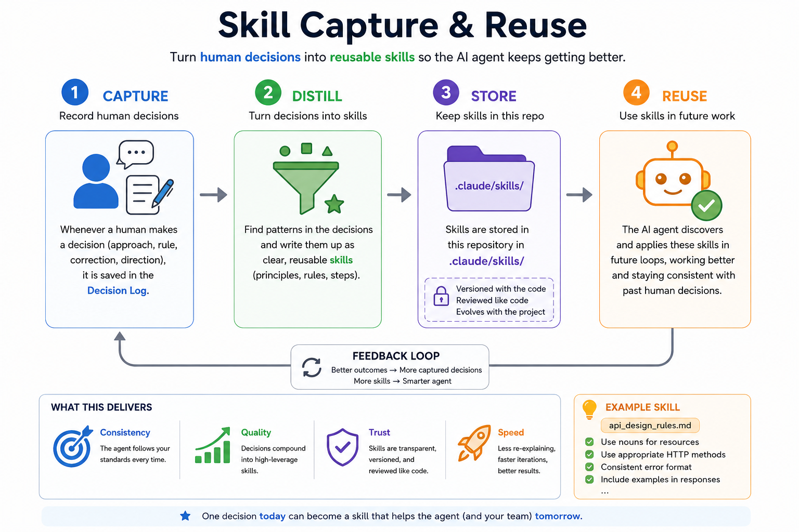

<div align="center">
  

  # Radio Calico · AI-DLC Demo

  [English](README.md) · **ไทย**

  **โปรเจกต์สาธิต AI-Driven Development Life Cycle ที่ขับเคลื่อน 100% ผ่าน GitHub**

  ทดสอบว่า Claude GitHub agent ทำงานพัฒนาซอฟต์แวร์ระดับ Production ได้แบบ end-to-end จริงหรือไม่ โดยมีมนุษย์เป็นผู้ตัดสินใจในทุกขั้นตอน

  `Human-in-the-loop` · `TDD` · `Skill capture & reuse` · `Production-grade`
</div>

---

## 1. นี่คืออะไร

Repo นี้ **ไม่ใช่แอปพลิเคชัน** แต่เป็น **การสาธิตกระบวนการ (process demo)**

เป้าหมายไม่ได้อยู่ที่การรันแอป Radio Calico บนเครื่อง local แต่อยู่ที่การพิสูจน์ว่า **ขั้นตอนการทำงาน (workflow)** ระหว่างมนุษย์กับ Claude GitHub agent สามารถผลิตงานระดับ production ได้จริงบน GitHub ทั้งหมด ตั้งแต่รับโจทย์ วางแผน เขียนเทส เขียนโค้ด ไปจนถึง review และ merge

> ทุกอย่างเริ่มจากการเปิด **GitHub issue** แล้ว tag `@claude`
> จากนั้น agent จะทำงานตาม **AI-DLC Loop** ด้านล่าง โดยหยุดรอมนุษย์ตัดสินใจในทุก gate

> **หมายเหตุเรื่องภาษา:** Repository นี้ใช้ **ภาษาไทยเป็นหลัก** สำหรับเอกสารกระบวนการ decision log และตัวอย่างทั้งหมด เพราะความแม่นยำที่จำเป็นในการทดสอบคำสั่ง Claude Agent บน GitHub ต้องใช้ภาษาไทย หากท่านสนใจติดตามชมกระบวนการนี้ สามารถใช้ **Google Translate** แปลทั้ง page เพื่ออ้างอิงของท่านได้

---

## 2. หลักการสำคัญ (Core Principles)

| หลักการ | ความหมาย |
|---|---|
| **Human decides, always** | มนุษย์ตัดสินใจทุกขั้น AI เสนอ ไม่ใช่ AI ตัดสิน |
| **TDD** | เขียน failing test ก่อนเสมอ แล้วค่อยเขียนโค้ดให้ผ่าน |
| **Test เฉพาะ AC** | เขียนเทสมุ่งที่ Acceptance Criteria เท่านั้น ไม่เขียนเยอะจน review ไม่ไหว |
| **Reuse-first** | เขียนโค้ดแบบใช้ซ้ำได้ และเทสตัวที่ reuse ได้ |
| **Review-sized PRs** | ถ้าโค้ด/เทสใหญ่เกินไป ต้องแตก ticket ให้มนุษย์ review ไหว |
| **Capture the decision** | ทุกการตัดสินใจของมนุษย์ถูกบันทึกเป็น *skill* เพื่อให้ agent เก่งขึ้นในรอบถัดไป |
| **Production-grade** | ทุก PR ต้องผ่าน gate ด้าน security และ quality |
| **ปิด issue ปัจจุบันให้จบ** | ฟังก์ชันที่ตกหล่นถูกดันเป็น issue ใหม่ ไม่ลากรวมใน loop เดิม |

---

## 3. Setup (เชื่อม `@claude` เข้ากับ repo)

ก่อนเริ่ม loop แรก ต้องเชื่อม Claude GitHub agent เข้ากับ repo นี้:

1. **ติดตั้ง Claude GitHub App** ให้ repo นี้ (ผ่าน Claude Code หรือ [github.com/apps/claude](https://github.com/apps/claude))
2. **เพิ่ม secret** `ANTHROPIC_API_KEY` ที่ *Settings → Secrets and variables → Actions*
3. **เพิ่ม workflow** `.github/workflows/claude.yml` ที่ trigger เมื่อมีการ mention `@claude` ใน issue หรือ PR comment ตัวอย่างโครง:

```yaml
name: Claude
on:
  issue_comment:
    types: [created]
  issues:
    types: [opened, assigned]
jobs:
  claude:
    if: contains(github.event.comment.body, '@claude') || contains(github.event.issue.body, '@claude')
    runs-on: ubuntu-latest
    permissions:          # least-privilege เท่าที่จำเป็น
      contents: write
      pull-requests: write
      issues: write
    steps:
      - uses: actions/checkout@v4
      - uses: anthropics/claude-code-action@v1
        with:
          anthropic_api_key: ${{ secrets.ANTHROPIC_API_KEY }}
```

> ปรับรายละเอียดตาม official docs ล่าสุดของ Claude Code GitHub Action เมื่อเชื่อมเสร็จ การพิมพ์ `@claude` ใน issue จะปลุก agent ให้เริ่มทำงานตาม loop

---

## 4. AI-DLC Loop (แกนหลัก)

<div align="center">
  
</div>

### รายละเอียดแต่ละขั้น

| # | ผู้ทำ | สิ่งที่เกิดขึ้น | Human gate | ส่งมอบ |
|---|---|---|---|---|
| **1** | Human | สร้าง issue (type: **Story / Improvement / Task**) ใส่รายละเอียดความต้องการ แล้ว tag `@claude` |  | Issue |
| **2** | AI | **ก่อนวางแผน** agent สร้าง **sub-agent** ไปหาข้อมูลตามกรอบ **5 คำถาม** (ดูด้านล่าง) เพื่อตีกรอบ AC ให้เหมาะสม จากนั้นสร้าง **plan + Acceptance Criteria** ที่ชัดเจนต่อแต่ละแผน |  | Plan + AC (comment) |
| **3** | Human | ตรวจ plan และ AC → ถ้าไม่โอเค comment ระบุจุดแก้ / ถ้าโอเค comment อนุมัติ **พร้อมระบุแนว unit test และ integration test ที่ต้องการ** — **หรือสั่งให้ AI ข้าม Test PR** แล้วไปทำ Code PR (ขั้น 6) ต่อเลย AI เองก็เสนอข้าม Test PR ได้เช่นกัน เมื่อขั้นนั้นซับซ้อนเกินกว่าจะเทสแยกได้ เทสยากจริง ๆ หรือต้อง build/scaffold ก่อนถึงจะเทสอะไรได้ — แต่ต้องให้มนุษย์ตอบรับชัดเจนใน gate นี้เท่านั้นถึงจะถือว่าข้ามจริง *หาก AI มีจุดสงสัย ต้องถามมนุษย์ให้เคลียร์ก่อน มนุษย์จึงสั่ง approve* | อนุมัติ plan (หรือสั่งข้าม Test PR) | Approved plan |
| **4** | AI | review plan อีกครั้ง แล้วเขียน **failing test เฉพาะ AC** ตามที่ approve → เปิด **Test PR** รอ review ข้ามได้ถ้าถูก waive ไว้ในขั้น 3 | | Test PR |
| **5** | Human | review และ **approve Test PR** เมื่อผ่าน AI จึงเริ่มขั้น 6 | อนุมัติ Test PR | Merged tests |
| **6** | AI | เขียนโค้ดตาม plan แบบ **reuse-first** → เปิด **Code PR** | | Code PR |
| **7** | Human | review code → สั่งแก้ได้ / ฟังก์ชันที่ตกหล่นดันเป็น **issue ใหม่** / เมื่อทุกอย่าง OK มนุษย์ **merge เข้า `develop`** จบ loop | merge | Code บน `develop` |

> **การแตก ticket:** ในขั้น 4 และ 6 หากโค้ด/เทสที่ generate มีขนาดใหญ่เกินไป Claude ต้อง **แบ่งเป็นหลาย ticket** ตามความเหมาะสม เพื่อให้มนุษย์ review ไหว

> **การวน (rework):** diagram วาดเป็น cycle เพื่อสื่อภาพรวมในทางปฏิบัติหากมนุษย์ review code (ขั้น 7) แล้วพบจุดต้องแก้ AI จะ **วนกลับไปแก้ที่ขั้น 6** (แก้โค้ด) แล้วเปิด Code PR ใหม่ จนกว่าจะผ่าน ส่วน**ฟังก์ชันที่ตกหล่น** ให้เปิดเป็น **issue ใหม่** ไม่แก้ปนใน loop เดิม เพื่อเน้นปิด issue ปัจจุบันให้จบ

### กรอบ 5 คำถามในขั้น 2 (Sub-agent context discovery)

ก่อนสร้าง plan sub-agent จะรวบรวมข้อมูลและตั้งคำถามกับมนุษย์ตามกรอบนี้ เพื่อตีกรอบ AC ให้แม่นที่สุด:

| ลำดับ | คำถาม | มุ่งค้นหา |
|---|---|---|
| 2.1 | **What's known?** | ข้อเท็จจริง/ข้อจำกัดที่รู้แน่แล้ว |
| 2.2 | **What if?** | สถานการณ์/เงื่อนไข edge case ที่อาจเกิด |
| 2.3 | **Now what?** | ขั้นถัดไปที่ควรทำ |
| 2.4 | **So what?** | ผลกระทบ/ความสำคัญของแต่ละทางเลือก |
| 2.5 | **What's unsaid?** | สิ่งที่ยังไม่ได้พูด/สมมติฐานที่ซ่อนอยู่ |

---

## 5. Quickstart: ตัวอย่างหนึ่งรอบ loop

**ขั้น 1 Human เปิด issue**

```
Title: [Story] ปุ่ม "Listen Now" บนหน้า hero
Type: Story

ในฐานะผู้เยี่ยมชม ฉันอยากมีปุ่ม "Listen Now" ที่ hero
เพื่อเริ่มเล่นสตรีมได้ทันที
- ใช้สี Forest Green (#1F4E23) ตาม style guide
- คลิกแล้วเริ่มเล่น HLS stream

@claude
```

**ขั้น 2 AI ตอบกลับ (ย่อ)**

```
สรุปจากกรอบ 5W:
- What's known: มี style guide + stream URL อยู่แล้ว
- What's unsaid: ต้องรองรับ pause ไหม? รองรับมือถือด้วยไหม?

แผน:
1. เพิ่มปุ่ม ListenNow (reuse Button component เดิม)
2. ต่อ HLS player เข้ากับ stream URL

Acceptance Criteria:
- AC1: ปุ่มแสดงด้วยสี #1F4E23 บน hero
- AC2: คลิกแล้ว stream เริ่มเล่นภายใน 2 วินาที

คำถามก่อนวางแผนต่อ: รอบนี้ต้องมีปุ่ม pause ด้วยไหม?
```

**ขั้น 3 Human approve**

```
ตอบ: รอบนี้ยังไม่ต้องมี pause แผนโอเค approved

Unit test: ปุ่ม render ด้วยสีถูกต้อง + เรียก play() เมื่อคลิก
Integration test: HLS player โหลด stream URL สำเร็จ
```

จากนั้น AI ทำ **ขั้น 4** (Test PR) → Human **approve (ขั้น 5)** → AI **ขั้น 6** (Code PR) → Human **review + merge (ขั้น 7)** ปิด loop

---

## 6. กติกาการทำงาน (Rules of Engagement)

- **มนุษย์ตัดสินใจทุกครั้ง** ไม่มีขั้นไหนที่ AI merge หรือ approve ตัวเอง
- **AI ถามเมื่อสงสัย** ก่อนมนุษย์ approve ในแต่ละ gate หาก AI มีจุดสงสัย ต้องถามมนุษย์ให้เคลียร์ก่อน ครอบคลุมถึงการทำเกินคำสั่งด้วย (over requirement) — ถ้าอยากเพิ่มอะไรที่นอกเหนือจากที่สั่งไว้ตรง ๆ ให้หยุดแล้ว review กับมนุษย์ก่อน อย่าลงมือทำแล้วค่อยมาดูทีหลังว่าต้องการหรือไม่
- **PR ต้อง review ไหว** ถ้าใหญ่เกิน ให้แตก ticket (ใช้ได้ทั้งขั้นเทสและขั้นโค้ด)
- **เทสยึด AC** ไม่เขียนเทสเกินขอบเขต AC ที่ตกลงกัน
- **Reuse-first** สร้างโค้ดที่ใช้ซ้ำได้ และเขียน unit test ครอบตัวที่ reuse
- **งานตกหล่น → issue ใหม่** ไม่ลากงานที่พบเพิ่มเข้ามาใน loop ปัจจุบัน เน้นปิด issue ปัจจุบันให้จบ **ข้อยกเว้น:** ถ้างานที่ตกหล่นเป็นของ ticket ที่เกี่ยวเนื่องซึ่งถูก sequence ไว้แล้วใต้ parent story เดียวกัน ให้ไปคอมเมนต์ไว้ที่ ticket นั้นแทนการเปิด issue ใหม่ — คอมเมนต์แบบไม่แท็ก (`@claude`) เพื่อให้มนุษย์เป็นคนแท็กเองเมื่อเริ่มงานส่วนนั้น
- **แยกชนิด PR** Test PR (ขั้น 4) และ Code PR (ขั้น 6) เป็นคนละ PR เพื่อ review เป็นชั้น ๆ — เว้นแต่มนุษย์จะสั่ง waive Test PR ไว้ชัดเจนในขั้น 3 โดย AI เสนอ waive ได้แต่ต้องไม่ตัดสินใจเองฝ่ายเดียว

---

## 7. Skill Capture & Reuse

หัวใจของการทำให้ agent "เก่งขึ้นเรื่อย ๆ" คือการเปลี่ยน **การตัดสินใจของมนุษย์** ให้กลายเป็น **skill ที่นำกลับมาใช้ซ้ำได้**

<div align="center">
  
</div>

- **จับ (Capture):** ทุกครั้งที่มนุษย์ตัดสินใจ (เช่น เลือกแนวทาง, กำหนดกติกา, แก้ทิศทาง plan) จะถูกบันทึกไว้ใน decision log
- **กลั่น (Distill):** การตัดสินใจที่เกิดซ้ำ/มีคุณค่า ถูกเขียนเป็น skill
- **เก็บ (Store):** skill ถูกเก็บไว้ใน **`.claude/skills/` ของ repo นี้เอง** — ไม่มี skills repo แยกต่างหากอีกต่อไป
- **เรียกใช้ (Reuse):** agent เรียก skill เหล่านี้ในรอบถัดไป ทำให้ทำงานได้ดีขึ้นและสอดคล้องกับการตัดสินใจเดิมของมนุษย์ นอกจากนี้ยังตรวจ `docs/knowledge-asset/published/` เพื่อดู skill ฉบับร่างที่รอมนุษย์นำไปใส่ไว้ที่ `.claude/skills/` และนำแนวทางในร่างนั้นมาใช้ระหว่างที่ยังรอการอนุมัติ ฉบับร่างที่ล้าสมัยแล้วจะถูกย้ายไปที่ `docs/knowledge-asset/deprecated/` และไม่ถูกนำมาใช้อีก

> **ทำไมเก็บใน repo เดียวกัน?** repo นี้มีไว้เพื่อสาธิตกระบวนการ AI-DLC แบบครบวงจร skills จึงสะสมอยู่ใน repo เดียวกับกระบวนการที่สร้างมันขึ้นมา แทนที่จะแยก checkout ต่างหาก

**AI review evaluations:** เลื่อนสถานะจาก trial ทดลอง มาเป็นแนวปฏิบัติมาตรฐาน ตอนปิด issue #99 ทุกครั้งที่ `@claude close` จะบันทึกไฟล์ใหม่หนึ่งไฟล์ไว้ที่ [`ai-review-evals/`](ai-review-evals/README.md) — เป็นบันทึกการตัดสินใจของ AI ในแต่ละ issue ที่มนุษย์จะให้คะแนนย้อนหลัง (`Instruction Fidelity`, `Result Satisfaction`) เพื่อใช้เป็นหลักฐานประกอบการตัดสินใจว่าการตัดสินใจแบบไหนของ AI จะย้ายจาก Human Review Everything ไปเป็น Human Review Risk ได้

---

## 8. โครงสร้าง Repository

```
aidlc-radiocalico/
├─ README.md                     ← เวอร์ชันภาษาอังกฤษ (default)
├─ README.th.md                  ← ไฟล์นี้ (ไทย): อธิบายกระบวนการ AI-DLC
├─ .github/
│  ├─ ISSUE_TEMPLATE/            ← เทมเพลต issue: story / improvement / task
│  ├─ pull_request_template.md   ← เช็กลิสต์ก่อน review PR
│  └─ workflows/                 ← claude.yml, CI, security scan, quality gates
├─ docs/
│  ├─ ai-dlc-loop.md             ← รายละเอียดเชิงลึกของ loop
│  └─ decisions/                 ← decision log (บันทึกการตัดสินใจของมนุษย์)
├─ specs/                        ← plan + AC ที่ AI สร้างต่อแต่ละ issue
├─ src/                          ← โค้ดผลิตภัณฑ์ Radio Calico
├─ tests/                        ← เทส (เขียนก่อนโค้ดตาม TDD)
└─ RadioCalicoStyle/             ← brand assets + style guide (มีอยู่แล้ว)
```

> **Skills** อยู่ใน repo นี้ ที่ `.claude/skills/<kebab-name>/SKILL.md`

### Branching

| Branch | ความหมาย |
|---|---|
| feature branch | ที่ AI เปิด Test PR / Code PR ในแต่ละ loop — ต้องระบุ `--base develop` ชัดเจนเสมอ (ห้ามพึ่ง default base branch ซึ่งอาจเป็น `main`) รวมถึงลิงก์ "Create PR" ที่พิมพ์เองในคอมเมนต์ก่อนมี PR จริง (`compare/develop...branch` ห้ามใช้ `compare/main...branch`) ก่อนแก้ไฟล์ใด ๆ AI ต้องตรวจก่อนว่า working tree ตรงกับ `origin/develop` จริง แล้ว sync ถ้าไม่ตรง (ดู issue #106 — บาง job checkout ไปที่ `main` แทน `develop`) เมื่อ PR เปิดแล้ว ให้คอมเมนต์ตามงานต่อที่ตัว PR นั้น (ไม่ใช่ที่ issue ต้นทาง) ไม่เช่นนั้น harness จะสร้าง branch ซ้ำซ้อนขึ้นมาใหม่โดยไม่ตั้งใจ ก่อนทำงานเดิมซ้ำที่เคยอนุมัติแล้ว ให้เช็คว่ามี branch/PR เดิมที่ diff เดียวกันอยู่แล้วหรือไม่ แล้วนำมาใช้ต่อแทนการเริ่มใหม่ |
| `develop` | ปลายทางของแต่ละ loop ที่สมบูรณ์ (มนุษย์ merge) |
| `main` | Production การ merge จาก `develop` → `main` คือ **prod release** และต้องทำโดย **มนุษย์เท่านั้น** |

การ merge หรือลบ branch (เช่น รวม branch ที่ซ้ำซ้อนกัน) เป็นการทำ git ด้วยมือโดยมนุษย์เท่านั้น — agent ทำได้แค่สร้างและ push commit ไปยัง branch เท่านั้น

---

## 9. โปรเจกต์ Radio Calico

ผลิตภัณฑ์ตัวอย่างที่ใช้ในการสาธิตคือ **Radio Calico** บริการฟังวิทยุ/สตรีมเสียง lossless คุณภาพสูง (24-bit / 48 kHz) แบบ ad-free

- **Brand & UI Style Guide:** [`RadioCalicoStyle/RadioCalico_Style_Guide.txt`](RadioCalicoStyle/RadioCalico_Style_Guide.txt)
- **Logo & Layout:** [`RadioCalicoStyle/`](RadioCalicoStyle/)
- **Stream URL:** ดูใน [`RadioCalicoStyle/stream_URL.txt`](RadioCalicoStyle/stream_URL.txt)

**Color palette:** Mint `#D8F2D5` · Forest Green `#1F4E23` · Teal `#38A29D` · Calico Orange `#EFA63C` · Charcoal `#231F20`

### Tech stack & การเทส

ตัดสินใจภายใต้ issue #20 (ดู `docs/decisions/`):

- **โค้ดแอป:** HTML + vanilla JavaScript + jQuery อ้างอิง dependency ผ่าน CDN `<script>` เท่านั้น ไม่มี build step ไม่มี `npm install` ถ้ายังเหลือ React อยู่บ้าง จะใช้แค่ `ReactDOM`/`React.createElement` เปล่า ๆ ไม่ติดตั้ง package เพิ่ม
- **ข้อมูล:** ใช้ `localStorage` เป็น "database"; ไม่มี backend store
- **เทส:** เขียนเทสแบบ vanilla JavaScript เองภายใต้ `tests/` รันเฉพาะเมื่อเปิดหน้า `tests/test-runner.html` ในเบราว์เซอร์เท่านั้น (ไม่รันตอนเปิดแอป ไม่รันผ่าน `npm test`) และ mock `localStorage` เฉพาะเท่าที่ AC ต้องใช้ หน้า `index.html` มีลิงก์ไปหน้ารายงานผลเทสนี้

---

## 10. มาตรฐาน Production-grade

ทุก Code PR (ขั้น 6) ต้องผ่าน gate เหล่านี้ก่อนมนุษย์จะ merge:

| หมวด | เกณฑ์ |
|---|---|
| **Security** | ผ่าน security scan (dependency, secret, SAST) · ไม่มี secret ใน repo · ตาม least-privilege |
| **Quality** | เทส AC ผ่านทั้งหมด (TDD) · lint/format ผ่าน · โค้ด reuse ได้และมีเทสครอบ หากขั้น 3 waive Test PR ไว้ Code PR ยังต้องพิสูจน์ว่าตรง AC ด้วยวิธีที่ตกลงกับมนุษย์ไว้ (เช่น รวมเทสไว้ใน Code PR หรือมีบันทึกการตรวจสอบด้วยมือ) |
| **Reviewability** | PR ขนาดพอเหมาะ · แตก ticket เมื่อจำเป็น · มีคำอธิบายเชื่อมโยงกับ AC |
| **Traceability** | ทุก PR อ้างอิงกลับไปยัง issue และ AC ที่เกี่ยวข้อง |

---

## 11. อ้างอิงและกิตติกรรมประกาศ (References & Acknowledgements)

- แนวคิดและกระบวนการในโปรเจกต์นี้ได้แรงบันดาลใจจากคอร์ส **"Claude Code: Building Faster with AI, from Prototype to Prod"** บน Udemy ขอบคุณ **Frank Kane**
- ขอบคุณ **คุณ Kunaruk Osatapirat** (Speaker) สำหรับหัวข้อ **"AI-driven architecture: Designing distributed systems at scale"** ในงาน **AWS Summit Bangkok 2026**

---

<div align="center">
  <sub>สร้างขึ้นเพื่อสาธิตความสามารถ end-to-end ของ Claude GitHub agent · Human-in-the-loop ทุกขั้นตอน</sub>
</div>
